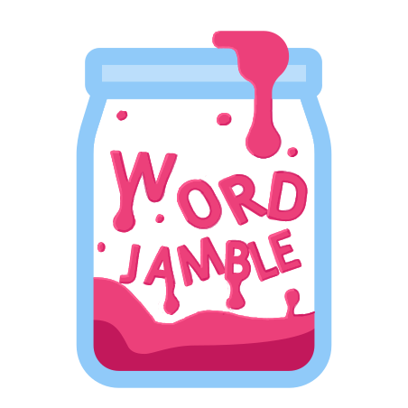

# Word Jamble

Our Entry to the [2021 Odin Edutainment Game Jam](https://itch.io/jam/top-jam-1).

### Play [here](https://chargrilledchook.github.io/word-jamble)!

## About

WIP - This doc is currently being re-written.

## Our Team

[Dylan](https://github.com/ChargrilledChook) - Programming logic

[Will](https://github.com/thewilheim) - Design, CSS and Responsiveness

Caz - Excel wizard and data cruncher

## Resources

[Project Board / Kanban](https://github.com/ChargrilledChook/odin-game-jam/projects/2)

[Figma file](https://www.figma.com/file/r72Qw5SsyVyrwoH3Gz1amW/Game-Jam-Ideas?node-id=2%3A72)

[Current colour palette](https://mycolor.space/?hex=%23C4A9C4&sub=1)

[Google sheets for vocab formatting](https://docs.google.com/spreadsheets/d/1gXyc7ziznObQP-k4xcyn5S9LdeM0bF2aE_BkVfqh9-w/edit#gid=0)
